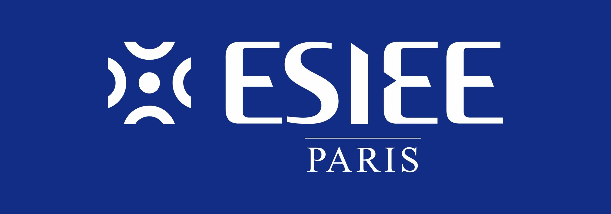

Matthieu FARANDJIS\
E3 IMAC

# SAÉ INF3-FI - Cluster Installation

---

 
Rapport du projet de TicTacToe "TicTacIMAC"
 

       

---

## Plan

- ## [I – Indications pour exécuter TicTacImac](#p1)
- ## [II – Explication sur l'organisation du code et choix d'implémentation](#p2)
- ## [III - Fonctionnalités supplémentaires](#p3)
- ## [IV - Bilan rapide sur les problèmes rencontrés et solutions trouvées](#p4)

---

###  I - Indications pour exécuter TicTacImac
Ce programme a été développé à la fois sur Windows 11 et Ubuntu 22.04 LTS à l'aide du logiciel CLion de JetBrains.\
J'utilise uniquement les librairies de base.\
\
Pour lancer le jeu, il suffit d'exécuter **Projet_Morpion.exe** qui se trouve dans le dossier `cmake-build-debug-windows`.\
Il y a également un raccourci Windows dans le répertoire principal du projet.\
\
L'utilisateur est accueilli par un menu ; il lui suffit d'indiquer le mode de jeu souhaité (1, 2 ou 3) à l'aide de son clavier pour que la partie commence.\
Le programme permet à l'utilisateur de saisir son nom ainsi que de choisir un symbole. Le joueur 2 (ou le joueur affrontant l'IA) ne peut pas choisir le même symbole que le joueur 1 (ou celui de l'IA).`\
À la fin de la partie, le jeu indique le vainqueur ou signale s'il y a une égalité. Pour recommencer une partie, il est nécessaire de réexécuter le programme.\
\
Remarque : le symbole de l'IA est **A** et il ne peut pas être changé.

##  II - Explication sur l'organisation du code et choix d'implémentation
- **main.cpp** : fichier C++ principal à exécuter.
- **jeu.cpp/.h** : contient TOUTES les fonctions liées au déroulement du jeu : modes de jeu, vérifications, choix de l'IA...
- **Player.cpp/.h** : contient la structure `Player` ainsi que les fonctions permettant la création d'un joueur.
- **tests.cpp/.h** : contient quelques fonctions qui testent le bon fonctionnement des fonctions vérifiant la victoire, l'égalité et la disponibilité des cases.

##  III - Fonctionnalités supplémentaires

J'ai implémenté un mode **IA Avancé** où l'IA va suivre un algorithme déterminant les meilleures actions à effectuer selon moi.\
Il ne remplace pas le mode IA aléatoire ! Ce nouveau mode est disponible via l'option 3 du menu.

##  IV - Bilan rapide sur les problèmes rencontrés et solutions trouvées

### Exécuter Projet_Morpion.exe en dehors de CLion
Un mini-problème que j'ai rencontré : je n'arrivais pas à lancer **Projet_Morpion.exe** directement en cliquant dessus (sans passer par CLion).\
Explication : il lui manquait une librairie.

La résolution a été assez simple, j'ai sollicité Gemini pour gagner du temps.\
Je tiens à souligner que l'utilisation de l'IA générative dans ce projet, en dehors de ce point, s'est résumée à un rappel de certaines fonctions en C++ (comme transformer un `char` en `string` sans que ce soit l'ID ASCII qui soit utilisé).
\
Il m'a proposé d'ajouter dans le fichier `CMakeLists.txt` : `set(CMAKE_EXE_LINKER_FLAGS "${CMAKE_EXE_LINKER_FLAGS} -static -static-libgcc -static-libstdc++")`

### Représenter le plateau de jeu avec une simple liste
L'énoncé suggérait de représenter un plateau de jeu avec une simple liste, et non pas 3 listes de 3 cases dans 1 grande liste.\
J'ai donc représenté le plateau avec une seule liste, ce qui n'a pas été simple pour les fonctions de vérification : je devais calculer manuellement la position de la prochaine case à analyser.\
\
Avec une liste de listes (tableau 2D), les vérifications auraient été beaucoup plus simples !\
Vérifier une colonne ? Aucun souci : il suffit d'analyser la case en position X des trois listes ; si le symbole est identique : c'est gagné.\
Dans mon cas, je devais effectuer des bonds de +3 (0+3 = 3, case juste en dessous de 0) et parfois des +2... Cela ne m'avait pas paru aussi complexe au départ !\
Comme je n'étais pas certain de mes fonctions, j'ai créé des fonctions de test de manière peu rigoureuse, mais qui remplissent néanmoins leur rôle.

### Amélioration à faire
- Je pense qu'il pourrait être mieux d'éclater jeu.cpp qui contient beaucoup de fonctions variées.
- Ça aurait peut-être été mieux de faire un .cpp dédié à l'IA, l'autre à la vérification du jeu (vérification de si un joueur a gagné, de s'il y a égalité ou encore de si l'action est possible ou non).
- Je n'avais pas fait plus attention au début, mais les fonctions et variables données dans l'énoncé sont en anglais... J'ai créé mon code en français. Ça fait un mélange pas très beau (pour être honnête, je pensais tout traduire juste avant de rendre le travail mais je me suis très mal organisé !).
- Je ne pense pas que mon code m'aurait permis d'effectuer l'amélioration Gomoku ou Puissance 4 tel quel. Je pense que j'aurais dû faire trop de modifications. En revanche, je pense qu'avec quelques petites modifications, l'Ultimate Tic-Tac-Toe était totalement compatible !